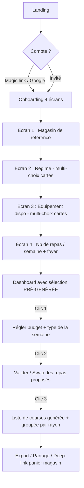
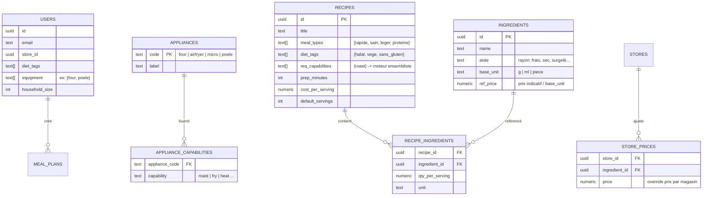

# SmartEat — Cahier des charges technique & fonctionnel (MVP)

> **Produit** : application web « Smart Shopping & Meal Planning »
> **Promesse** : supprimer la charge mentale de « qu'est-ce qu'on mange + qu'est-ce qu'on achète ».
> **Cible de déploiement** : Vercel (Next.js, Serverless / Edge).
> **Contrainte ergonomique structurante** : ≤ 3 clics entre l'ouverture de l'app et la liste de courses générée.
> **Références d'inspiration** : parcours d'achat de **Jow**, précision nutritionnelle de **MyFitnessPal**, fluidité visuelle de **Linear**.

---

## Principe directeur : on choisit *moins*, pas *plus*

La plupart des apps de meal planning échouent parce qu'elles transforment un problème de fatigue décisionnelle en un *deuxième* travail (créer des recettes, taguer, configurer). Notre parti pris : **l'app décide à la place de l'utilisateur, qui se contente de valider ou de remplacer.** Toutes les variables (régime, équipement) sont capturées **une seule fois** à l'onboarding et deviennent invisibles ensuite. La génération hebdomadaire ne demande qu'un arbitrage léger (budget + type), puis propose un résultat prêt à valider.

Règle de conception transversale : **chaque écran ne pose qu'une seule question.**

---

## 1. User Journey & Onboarding

### 🧠 Réflexion — réduire la friction
Le moment où l'on perd l'utilisateur, c'est l'onboarding (formulaires) et l'écran blanc (« à toi de jouer »). Deux décisions :
1. **Découpler les préférences durables des arbitrages ponctuels.** Régime et équipement ne changent quasiment jamais → on les demande une fois, à l'inscription, écran par écran (une question = un écran, gros boutons-cartes, pas de dropdown). Type de repas et budget changent chaque semaine → on les demande au moment de générer.
2. **Supprimer l'écran blanc.** À la fin de l'onboarding, l'utilisateur arrive sur un dashboard où **une première sélection de repas est déjà pré-remplie**. Il n'a rien à créer ; il valide ou remplace. Le « cold start » devient un « warm start ».

L'inscription elle-même est une friction : on privilégie le **magic link / OTP** (pas de mot de passe) et un **mode invité** possible (génération sans compte, compte demandé seulement au moment de sauvegarder/exporter).

### Flux complet



### Détail des étapes

| Étape | Ce que voit l'utilisateur | Donnée capturée | Persistance |
|---|---|---|---|
| Auth | Champ e-mail → lien magique, ou « Continuer sans compte » | `user.email` | Profil |
| Onboarding 1 | Liste de magasins (logos) | `store_id` | Profil |
| Onboarding 2 | Cartes : Halal, Végé, Vegan, Sans-gluten, Sans-lactose, Aucun | `diet_tags[]` | Profil |
| Onboarding 3 | Cartes : Four, Air Fryer, Micro-ondes, Poêle (multi) | `equipment[]` | Profil |
| Onboarding 4 | Stepper : nb de repas/semaine + nb de personnes | `meals_per_week`, `household_size` | Profil |
| Dashboard | Sélection pré-générée (4–7 repas) | — | Session |

### Le parcours « ≤ 3 clics » (cœur du produit)
Une fois l'onboarding fait, **toute génération ultérieure** respecte la règle :

1. **Clic 1 — Intention** : « Générer ma semaine » → modale légère *type + budget* (sliders/segmented control, valeurs par défaut = dernier choix). L'utilisateur peut même ne rien toucher.
2. **Clic 2 — Arbitrage** : l'app affiche N repas proposés (cartes façon Jow). Swipe/tap pour remplacer un repas qu'on n'aime pas (le moteur propose un substitut équivalent en contraintes). Bouton « Valider la sélection ».
3. **Clic 3 — Résultat** : « Générer la liste » → liste agrégée, dédupliquée, groupée par rayon, avec coût estimé. Export en un tap.

> Le swap (clic 2) est *optionnel* : un utilisateur pressé fait Clic 1 → Clic 3 en 2 actions.

---

## 2. Logic Engine (Backend) — Recipe Matching Engine

### 🧠 Réflexion — réduire la friction (côté données)
Le piège « combinatoire » : on serait tenté d'écrire des `if/else` par appareil (« si Four… sinon si Air Fryer… »). Ça n'évolue pas. L'insight clé : **on ne raisonne pas en *appareils* mais en *capacités de cuisson*.**

Un appareil **fournit** des capacités ; une recette **requiert** des capacités. Une recette est faisable si l'ensemble de ses capacités requises est **inclus** dans l'union des capacités des appareils que possède l'utilisateur. Avantage immédiat : « rôtir » est fourni *à la fois* par le Four et l'Air Fryer → la substitution « Four ↔ Air Fryer » émerge **gratuitement** du modèle, sans aucune règle écrite à la main.

| Appareil | Capacités fournies |
|---|---|
| Four | `roast`, `bake`, `gratin`, `heat` |
| Air Fryer | `roast`, `fry`, `heat` |
| Poêle | `fry`, `sear`, `simmer`, `heat` |
| Micro-ondes | `heat`, `reheat`, `steam` |

→ Une recette `required_capabilities = {roast}` est éligible pour **Four OU Air Fryer**. Une recette `{roast, simmer}` exige Poêle **+** (Four ou Air Fryer). Tout devient une opération ensembliste indexable.

### Schéma de données simplifié



**Choix pragmatiques pour le MVP :**
- `diet_tags`, `meal_types`, `req_capabilities` sont des **tableaux Postgres** indexés en **GIN** → filtrage par opérateurs d'inclusion (`@>`, `<@`) ultra-rapide, sans table de jointure superflue.
- Les capacités utilisateur ne sont *pas* stockées : on les **dérive** de `equipment` via `APPLIANCE_CAPABILITIES` (matérialisable en vue si besoin de perf).
- Le prix : un `ref_price` global sur l'ingrédient + `STORE_PRICES` en *override* optionnel par magasin. Pas besoin de catalogue complet pour démarrer.

### Algorithme de matching (2 passes : filtre dur → scoring doux)

**Passe 1 — Filtres durs (élimination, en SQL).** Une recette survit si :
- elle satisfait **tous** les régimes choisis : `recipe.diet_tags @> user.diet_tags`
- ses capacités requises sont couvertes : `recipe.req_capabilities <@ user_capabilities`
- son coût/portion ≤ plafond par repas : `cost_per_serving ≤ budget / meals_per_week`

```sql
-- user_caps = SELECT array_agg(DISTINCT capability) FROM appliance_capabilities
--             WHERE appliance_code = ANY($user_equipment)
SELECT *
FROM recipes r
WHERE r.diet_tags        @> $diet_tags          -- contient tous les régimes requis
  AND r.req_capabilities <@ $user_caps          -- réalisable avec l'équipement
  AND r.cost_per_serving <= $budget_per_meal
  AND ($meal_types = '{}' OR r.meal_types && $meal_types); -- intersection si filtre type
```

**Passe 2 — Scoring doux (classement, en TypeScript ou SQL).** Sur les survivants, on calcule un score pour **ranger** (pas exclure) :

```
score = w_type   * overlap(recipe.meal_types, wanted_types)   // colle aux envies
      + w_budget * (1 - cost_per_serving / budget_per_meal)    // marge budget
      + w_time   * (recipe.prep_minutes <= 25 ? 1 : 0)         // rapidité
      + w_variety* nouveauté_vs_dernières_semaines             // évite la répétition
```
Poids par défaut : `w_type=0.4, w_budget=0.2, w_time=0.2, w_variety=0.2`.

**Sélection finale & budget :** on prend les `meals_per_week` meilleures recettes. La vraie optimisation budgétaire est un *bounded knapsack* (maximiser le score sous contrainte de coût total). **Pour le MVP, on ne fait PAS de knapsack** : on applique le plafond *par repas* (`budget/meals_per_week`) qui garantit déjà `Σ ≤ budget`, et on classe par score. Le knapsack global est repoussé en V2 (gain marginal, coût d'implémentation élevé).

**Swap (clic 2) :** remplacer un repas = relancer la passe 1+2 en excluant les recettes déjà sélectionnées (`AND r.id <> ALL($selected)`) et renvoyer le top 1.

### Génération de la liste de courses
1. Récupérer `RECIPE_INGREDIENTS` des recettes retenues.
2. Mettre à l'échelle : `qty = qty_per_serving × household_size` (avec conversion vers `base_unit`).
3. **Agréger / dédupliquer** par `ingredient_id` (sommer les quantités, normaliser l'unité).
4. **Grouper par `aisle`** (rayon) pour un parcours magasin logique — *exactement le réflexe Jow*.
5. Calculer le coût estimé : `Σ qty × (store_price ?? ref_price)`.
6. (V2) Soustraire les produits « placard » déjà possédés.

---

## 3. UX/UI Guidelines

### 🧠 Réflexion — réduire la friction (côté interface)
La fluidité « Linear » vient de trois choses : densité d'information maîtrisée, transitions immédiates (< 100 ms perçu), et **un seul appel à l'action évident par écran**. On applique Material Design 3 (tokens, dynamic color, états) pour la rigueur des composants, et on emprunte aux Apple HIG le rythme (gros titres, marges généreuses, zones tactiles ≥ 44 px). **Mobile-first** strict : on conçoit pour le pouce d'abord (CTA en bas d'écran, *thumb zone*), le desktop n'est qu'un élargissement.

### Palette de couleurs (tokens)

| Token | Light | Dark | Usage |
|---|---|---|---|
| `--primary` | `#16A34A` (vert frais) | `#22C55E` | CTA, sélection active |
| `--on-primary` | `#FFFFFF` | `#062B12` | texte sur primary |
| `--surface` | `#FFFFFF` | `#0B0F0E` | fond cartes |
| `--surface-variant` | `#F1F5F3` | `#1A211F` | fonds secondaires |
| `--on-surface` | `#0F172A` | `#E7ECEA` | texte principal |
| `--outline` | `#D6DEDB` | `#2A332F` | bordures discrètes |
| `--accent` | `#F59E0B` (ambre) | `#FBBF24` | budget / alertes douces |
| `--error` | `#DC2626` | `#F87171` | erreurs |

Vert = aliment frais/sain (cohérent avec la promesse), ambre réservé au signal **budget**. Contrastes conformes WCAG AA.

### Typographie
- **Police** : `Inter` (system-ui en fallback) — neutre, lisible en petite taille, chargée via `next/font` (zéro CLS, self-host automatique sur Vercel).
- **Échelle (Material 3, mobile)** : Display `32/40` semibold · Title `22/28` semibold · Body `16/24` regular · Label `13/16` medium · Caption `12/16`.
- Chiffres tabulaires (`font-variant-numeric: tabular-nums`) pour les prix et quantités.

### Composants clés

| Composant | Rôle | Pattern |
|---|---|---|
| **FilterSheet** | sélecteur de filtres (type + budget) | *bottom sheet* M3 ; type = `SegmentedButton` multi ; budget = `Slider` avec valeur live ; valeurs par défaut pré-cochées |
| **RecipeCard** | repas proposé | image, titre, badges (temps, €, type), bouton « ↻ Remplacer » ; *swipe-to-swap* sur mobile |
| **MealStepper** | quantité de repas / personnes | contrôle `−  n  +`, gros tactiles |
| **ChoiceCard** | onboarding (régime/équipement) | carte sélectionnable (icône + label), état cochée très visible, multi-sélection |
| **ShoppingList** | résultat | sections collapsibles par rayon, checkbox par ligne, total € sticky en bas |
| **PrimaryCTA** | action unique par écran | bouton plein largeur, sticky bas (*thumb zone*), libellé = verbe (« Générer ma liste ») |

**Micro-interactions** : transitions 150–200 ms, *optimistic UI* sur le swap (la carte change instantanément, la requête suit), *skeleton loaders* pendant la génération (jamais de spinner plein écran). États vides remplacés par des suggestions pré-générées.

**Accessibilité** : zones tactiles ≥ 44×44 px, focus visibles, support du *dynamic type*, labels ARIA sur les cartes sélectionnables.

---

## 4. Stack Technique & Vercel Config

### 🧠 Réflexion — réduire la friction (côté déploiement)
La friction technique tue les MVP autant que la friction UX. On choisit une stack où **chaque brique a une intégration Vercel native** (zéro plomberie infra), où l'auth et la base sont *managées* (pas de serveur à tenir), et où le rendu peut rester majoritairement en *Server Components* (moins de JS envoyé, app rapide par défaut).

### Stack recommandée

| Couche | Choix | Pourquoi |
|---|---|---|
| Framework | **Next.js 14+ (App Router, RSC)** + TypeScript | natif Vercel, Server Actions = moins d'API à câbler |
| UI | **Tailwind CSS** + **shadcn/ui** (Radix) | composants accessibles, tokens M3 mappables, mobile-first |
| Base de données | **Supabase (PostgreSQL)** | Postgres managé, arrays + GIN pour le moteur, free tier généreux |
| Auth | **Supabase Auth** (magic link / OTP, Google) | sans mot de passe, RLS par défaut |
| ORM | **Drizzle ORM** | typé, léger, *edge-compatible*, migrations simples |
| Validation | **Zod** | schémas partagés client/serveur |
| Config dynamique | **Vercel Edge Config** | catalogue magasins + feature flags lus en < 1 ms, sans déploiement |
| State client | **TanStack Query** (mutations/optimistic) | swap optimiste, cache |

> **Réalisme sur l'intégration magasin** : les API de catalogue/prix des enseignes (Carrefour, Leclerc…) sont fermées ou contractuelles. **Pour le MVP, on n'intègre AUCUNE API retailer.** « Choisir le magasin » = sélectionner un **profil de prix** (table `STORE_PRICES` + référentiel dans Edge Config) et la liste finale est **exportable** (copier, partager, CSV, deep-link vers le panier quand l'enseigne l'autorise). L'intégration panier temps réel est explicitement repoussée en V2/V3.

### Architecture sur Vercel

```
Client (RSC + îlots Client Components)
        │  Server Actions / Route Handlers
        ▼
Vercel Serverless Functions (région CDG/fra1, proche de la DB)
        │  Drizzle (pooler)
        ▼
Supabase Postgres  ──  Edge Config (catalogue magasins, flags)
```

- **Matching Engine** : exécuté dans une **Server Action** (ou Route Handler `/api/generate`) en runtime **Node** (Drizzle + pooler Postgres). On reste en région **`fra1` (CDG)** pour coller à la DB UE et réduire la latence.
- **Lectures légères** (liste des magasins, flags) : **Edge Config** (lecture quasi nulle, pas de cold start DB).
- **Rendu** : pages en **Server Components** par défaut ; seuls les composants interactifs (FilterSheet, swap) sont *Client*.

### Fichiers de configuration

`vercel.json`
```json
{
  "regions": ["fra1"],
  "framework": "nextjs"
}
```

`next.config.js`
```js
/** @type {import('next').NextConfig} */
const nextConfig = {
  reactStrictMode: true,
  images: {
    remotePatterns: [{ protocol: "https", hostname: "**.supabase.co" }]
  },
  experimental: { serverActions: { bodySizeLimit: "1mb" } }
};
module.exports = nextConfig;
```

`.env.example` (variables à déclarer dans Vercel → *Project Settings → Environment Variables*)
```bash
NEXT_PUBLIC_SUPABASE_URL=
NEXT_PUBLIC_SUPABASE_ANON_KEY=
SUPABASE_SERVICE_ROLE_KEY=        # serveur uniquement, jamais exposé au client
DATABASE_URL=                     # connexion poolée (pgbouncer) pour Serverless
EDGE_CONFIG=                      # token de connexion Edge Config
```

> Règle de sécurité : seules les variables **`NEXT_PUBLIC_*`** atteignent le navigateur. La `SERVICE_ROLE_KEY` et `DATABASE_URL` restent côté serveur. Activer **RLS** sur toutes les tables `users`/`meal_plans`.

---

## 5. Feature Roadmap (MVP vs V2)

### 🧠 Réflexion — réduire la friction (côté périmètre)
La friction la plus coûteuse au lancement, c'est le *scope*. On ne garde que ce qui sert directement la boucle « préférences → repas → liste ». Tout ce qui demande à l'utilisateur de produire du contenu, ou qui dépend d'intégrations tierces fragiles, attend.

### MVP — 3 fonctionnalités indispensables
1. **Onboarding des préférences durables** (régime + équipement + foyer + magasin de référence) — sans ça, pas de personnalisation.
2. **Recipe Matching Engine** (filtre par capacités/régime/budget + scoring + swap) — c'est le **cœur différenciant**, la « combinatoire intelligente ».
3. **Génération + export de la liste de courses** (agrégation, dédoublonnage, groupement par rayon, coût estimé, partage/CSV) — c'est le **livrable** qui crée la valeur.

### V2 et au-delà (volontairement repoussé)
| Fonction | Pourquoi plus tard |
|---|---|
| Intégration panier temps réel des enseignes | API fermées/contractuelles ; deep-link + export suffisent au MVP |
| Optimisation budgétaire *knapsack* globale | le plafond par repas couvre 90 % du besoin |
| Macros/calories détaillées (précision MyFitnessPal) | nécessite une base nutritionnelle fiable ; afficher un proxy simple (kcal estimées) d'abord |
| Gestion du « placard » (soustraire ce qu'on a déjà) | fort UX, mais demande un suivi de stock → V2 |
| Recettes créées par l'utilisateur / communauté | génère du contenu à modérer ; catalogue éditorial au lancement |
| Multi-magasins / comparaison de prix | dépend de données prix riches |
| Notifications, historique, favoris | confort, pas cœur de valeur |

---

## 6. Checklist de déploiement Vercel

### 🧠 Réflexion — réduire la friction (mise en prod)
On veut un *pipeline* où `git push` = déploiement. Vercel le fait nativement ; il suffit de ne pas se tromper sur l'ordre **base → variables → build → migration → live**.

### Étapes (du code au site live)

**A. Pré-requis base de données**
- [ ] Créer le projet **Supabase** (région UE, ex. `eu-central-1`).
- [ ] Appliquer les migrations Drizzle : `npx drizzle-kit generate && npx drizzle-kit migrate`.
- [ ] Activer **RLS** sur `users`, `meal_plans` ; policies « owner only ».
- [ ] *Seed* du catalogue (recettes, ingrédients, `appliance_capabilities`, `store_prices`).

**B. Connexion du repo à Vercel**
- [ ] Importer le repo GitHub dans Vercel (framework auto-détecté : Next.js).
- [ ] Vérifier *Build Command* = `next build`, *Output* géré par Next, *Install* = `npm install`.

**C. Variables d'environnement** (onglet *Environment Variables*, scope **Production** + **Preview**)
- [ ] `NEXT_PUBLIC_SUPABASE_URL`, `NEXT_PUBLIC_SUPABASE_ANON_KEY`
- [ ] `SUPABASE_SERVICE_ROLE_KEY`, `DATABASE_URL` (URL **poolée** pgbouncer, port 6543)
- [ ] `EDGE_CONFIG` (créer le store Edge Config, y mettre la liste des magasins + flags)
- [ ] Confirmer que seules les `NEXT_PUBLIC_*` sont publiques.

**D. Configuration projet**
- [ ] `vercel.json` avec `"regions": ["fra1"]` (proximité DB UE).
- [ ] `next.config.js` (images Supabase, server actions).
- [ ] Vérifier `package.json` : Node 18+/20, scripts `build`/`start`.

**E. Build & déploiement**
- [ ] Pousser sur une branche → **Preview Deployment** automatique ; tester le parcours ≤ 3 clics.
- [ ] Vérifier les logs de fonction (région `fra1`, pas de cold start DB anormal).
- [ ] Merge sur `main`/`develop` → **Production Deployment**.
- [ ] (Option) Brancher le **domaine custom** + HTTPS auto.

**F. Post-déploiement (smoke tests)**
- [ ] Auth magic link OK (mail reçu, session créée).
- [ ] Onboarding persiste bien `diet_tags` / `equipment`.
- [ ] Génération renvoie des recettes cohérentes avec l'équipement (tester « seulement Air Fryer » → aucune recette `bake`-only).
- [ ] Liste agrégée correcte (quantités sommées, groupées par rayon, total €).
- [ ] Export/partage fonctionnel.
- [ ] Lighthouse mobile : LCP < 2,5 s, pas de CLS.

**G. Garde-fous**
- [ ] Activer **Vercel Analytics** + logs.
- [ ] Sauvegardes Supabase activées.
- [ ] Feature flags (V2) pilotés par **Edge Config** sans redéploiement.

---

### Annexe — Résumé des décisions « réalistes » prises pour le MVP
- **Pas d'API retailer** → profil de prix + export/deep-link.
- **Pas de knapsack budget** → plafond par repas.
- **Pas de saisie de recettes utilisateur** → catalogue éditorial *seedé*.
- **Modèle par capacités de cuisson** (et non par appareils) → substitution Four/Air Fryer gratuite.
- **Préférences durables vs arbitrages ponctuels** découplées → parcours ≤ 3 clics tenable.
